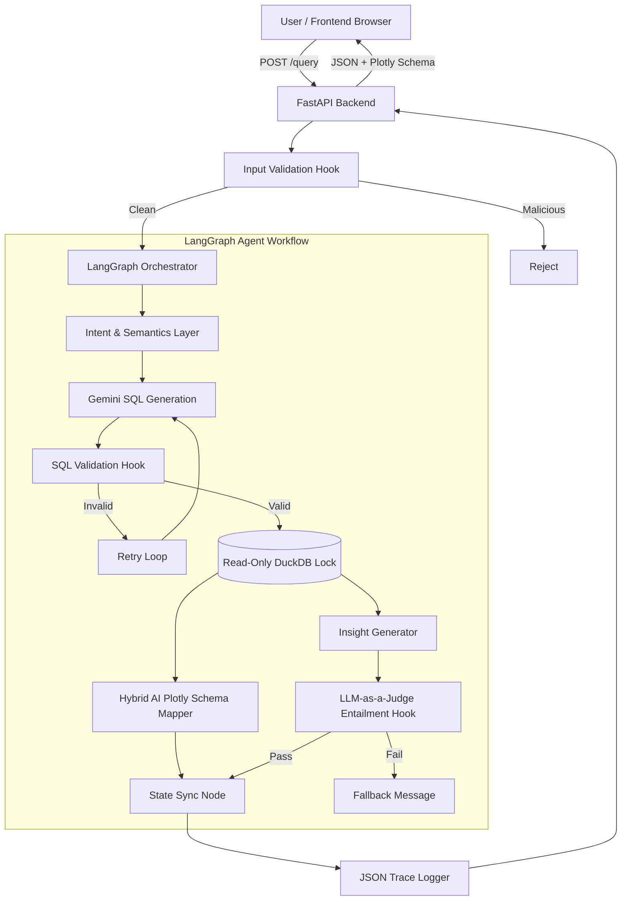

# Prompt-to-Plot 🚀

An end-to-end, deterministic Agentic BI platform built for the 2026 AI Hackathon. Prompt-to-Plot seamlessly translates natural language into secure, mathematically grounded, interactive visualizations using **Gemini 3.1 Flash**, **LangGraph**, and **DuckDB**. 

### 🌟 Massive Autonomous Overhaul Highlights
- **Native Structured Outputs:** Utilizes Gemini's Pydantic `response_schema` API constraints to guarantee 100% reliable JSON generation.
- **LLM-as-a-Judge Entailment Grounding:** Replaces brittle regex with an incredibly strict secondary LLM judge that semantically entails the insight, mathematically preventing calculated hallucinations.
- **Hybrid Visualization Mapping:** Dynamically selects the best Plotly axes and cluster colors using AI, ensuring visuals never crash on unknown columns.
- **Resilient Retry Loops:** Implements strict LangGraph reducers and Tenacity exponential backoff to autonomously survive API quotas (`429`) and SQL syntax errors.
- **Premium Dynamic UI/UX:** Features a state-of-the-art dark mode interface with animated glassmorphism, pulse interactions, and a beautiful gradient aesthetic.

## 1. End-to-End Architecture



## 2. Final Folder Structure

```text
prompt-to-plot/
├── backend/
│   ├── main.py                # FastAPI Application & Frontend Router
│   ├── config.py              # Environment variables and settings
│   ├── agent/
│   │   ├── graph.py           # LangGraph StateMachine Orchestrator
│   │   ├── tools.py           # Agent logic (SQL generation, lookup)
│   │   ├── visualization.py   # Deterministic Plotly JSON Generator
│   │   ├── insight.py         # Grounded Insight Safeguards
│   │   └── context.py         # JSON Tracing & Journaling
│   ├── data/
│   │   └── database.py        # Isolated DuckDB connection pool
│   ├── llm/
│   │   └── gemini.py          # LLM Client with Exponential Backoff
│   └── security/
│       └── hooks.py           # Deterministic validation rules
├── docs/
│   ├── Threat_Model.md        # Comprehensive Security Model
│   └── Harness_Ablation.md    # Agent Benchmark Methodology
├── evals/
│   └── run_evals.py           # Comprehensive Agent Benchmark Suite
├── frontend/
│   ├── index.html             # Vanilla UI Layout
│   ├── style.css              # Premium Dark-Mode Glassmorphism
│   └── app.js                 # API Integration & Plotly Renderer
├── logs/
│   ├── evals/                 # Evaluation test results
│   └── traces/                # Secure JSON execution journals
├── tests/                     # Unit test suites (pytest)
├── data/                      # Sample CSV data
├── .env                       # Environment variables
└── requirements.txt           # Python dependencies
```

## 3. Explanation of the Agent Workflow
The core brain is a **LangGraph StateMachine** operating on a strictly typed `AgentState` object. It executes sequentially:
1. **validate_input**: Blocks malicious prompts.
2. **understand_intent**: Extracts dimensions, measures, and chart intents.
3. **lookup_semantics**: Maps business terms to actual database schemas.
4. **generate_sql**: LLM drafts DuckDB SQL.
5. **validate_and_retrieve**: Tries to run the query. If it fails (or attempts mutation), the state loops back to `generate_sql` (up to 3 times) to self-correct.
6. **select_visualization**: Deterministically maps the resulting data shape to a Plotly chart (e.g., 2 columns with a date = Line Chart).
7. **generate_insight**: LLM drafts a concise summary.

## 4. Explanation of Each Tool
Rather than giving the LLM generic tools (like a Python REPL), we strictly constrain its environment:
- **`schema_lookup`**: Returns only the allowed table schemas (e.g., `sales`). The LLM is blind to the rest of the database.
- **`viz_select`**: The LLM is completely banned from selecting its own visualizations. This python tool reads the data array length and column types to build a guaranteed-correct Plotly JSON schema.
- **`insight_generate`**: Forces the LLM into a strict JSON template (Fact, Insight, Action).

## 5. Explanation of Each Security Hook
Instead of relying on the LLM to self-police, we use deterministic Python functions:
- **`Input Validation Hook`**: Regex scanner that immediately rejects jailbreaks ("Ignore previous instructions", "sudo").
- **`SQL Validation Hook`**: Scans the generated SQL string before execution. If it contains `DROP`, `DELETE`, `INSERT`, `UPDATE`, or `ALTER`, it forcefully throws an error, triggering the LangGraph retry loop to fix it.
- **`Grounded Insight Hook`**: Extracts all numbers from the LLM's text output and verifies they exist in the raw DuckDB data. If the LLM invents or calculates a fake number, the insight is rejected.

## 6. How to Run the Complete Application Locally

1. Create a virtual environment and install dependencies:
   ```bash
   python -m venv venv
   .\venv\Scripts\Activate.ps1
   pip install -r requirements.txt
   ```
2. Start the Backend API (which also serves the Frontend):
   ```bash
   python -m backend.main
   ```
3. Open your browser and navigate to: **[http://localhost:8000](http://localhost:8000)**

## 7. How to Run the Evaluation Suite

To prove the agent's resilience against complex queries, hallucinations, and injection attacks, run the Evaluation Harness. This runs 10 complex scenarios (including self-healing recovery tests) without a UI.

```bash
python -m evals.run_evals
```

## 8. How to Inspect Traces

Every single interaction in the frontend or evaluation suite is deterministically logged.

1. Navigate to the `logs/traces/` directory.
2. Open the `trace_<uuid>.json` file.
3. **What you'll see**: A complete timeline of the agent's thought process, including the exact SQL generated, validation errors hit, retry counts, selected Plotly schemas, and execution duration. API keys and massive raw datasets are automatically scrubbed for security.
